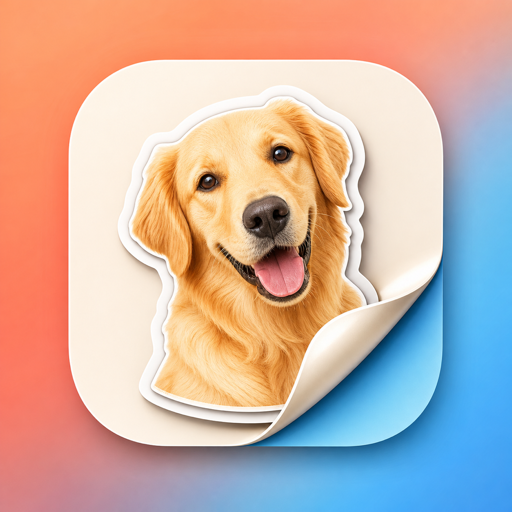

# PocketStickers

PocketStickers is a local-first sticker library for iPhone and Messages.

This site is the minimal public information surface for the app. It exists to provide clear product, support, and privacy information without exposing the full working development repository.

## What It Is

- Create stickers from your own photos and files
- Keep your library local on-device
- Organize stickers for reuse
- Browse and send them from the Messages extension

## What It Is Not

- No required account
- No public sticker marketplace
- No social profile system
- No cloud backend required for core flows

## Public Information

- PocketStickers does not require an account.
- Core sticker creation, organization, search, and sending are local-first.
- The Messages extension reads the local shared App Group sticker index created by the main app.

## Links

- [Support](support.html)
- [Privacy Policy](privacy-policy.html)
- [GitHub Issues](https://github.com/LarryAlexander/PocketStickers-site/issues)

## Need Help?

Use the support page for troubleshooting details and the current public contact path.
